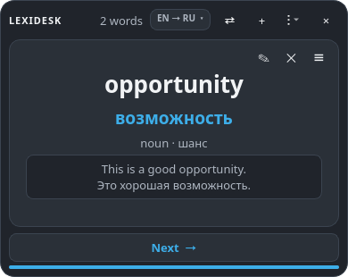
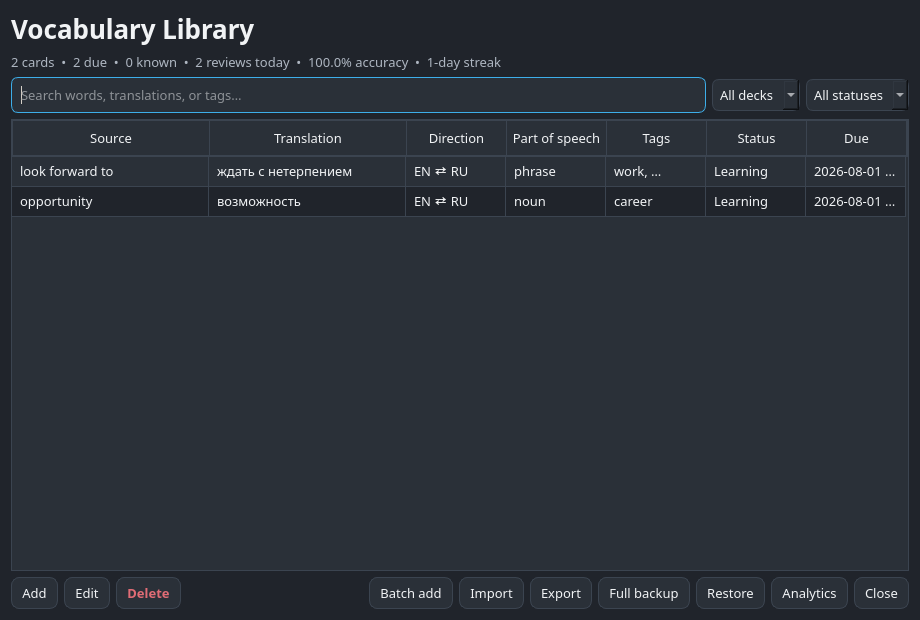
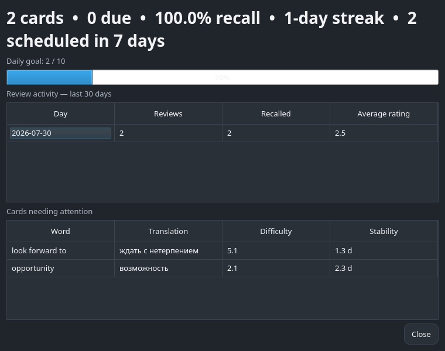

# LexiDesk

LexiDesk is a multilingual offline vocabulary companion for Windows,
KDE Plasma 6, and other Linux desktops. Its application core is written in
Python with PySide6, and its optional native Plasma widget uses QML.

The app starts with an empty vocabulary. Choose any installed source and target
language, let the local model suggest a translation, review it, and save it.
Cards rotate every 90 seconds by default.







## Download

Ready-to-run packages are published on the
[GitHub Releases page](https://github.com/Mozzhukhin/LexiDesk/releases/latest):

| System | Download | How to use it |
| --- | --- | --- |
| Windows 10/11 x64 | `LexiDesk-Setup-Windows-x64.exe` | Run the installer. It can create desktop and automatic-start shortcuts. |
| Windows x64, portable | `LexiDesk-Windows-x64-portable.zip` | Extract the whole archive and run `LexiDesk.exe`. |
| Linux x86_64 | `LexiDesk-Linux-x86_64.AppImage` | Make it executable and open it. No system Python is required. |
| Linux x86_64, portable | `LexiDesk-Linux-x86_64.tar.gz` | Extract it and run `LexiDesk/LexiDesk`. |
| KDE Plasma 6 | `LexiDesk-Plasma6.plasmoid` | Optional native desktop add-on; install the Linux core first. |
| Python 3.12–3.14 | `.whl` or `.tar.gz` source package | Intended for distributions and developers. |

GitHub builds Windows and Linux packages on their corresponding operating
systems from the same source code. `SHA256SUMS.txt` lets you verify every
release download. Ready-to-run Windows and Linux packages include the EN↔RU
models, dictionary, and example index, so translation works immediately without
a network connection. A source installation downloads this data once during
`scripts/setup.sh`.

## Features

- Fully offline translation after installing the selected language packages
- Direct and two-step translation routes between any installed languages
- An in-app manager for downloading official Argos language models on demand
- A 99,000-headword FreeDict index cross-checked in both translation directions
- Compact CTranslate2 neural fallback for phrases and missing dictionary entries
- Short examples validated against both the studied word and selected meaning
- One short verified bilingual example per card
- Conservative offline autocorrection for misspelled English and Russian words
- Clean card meanings without sentence-ending periods or duplicate variants
- Words and short phrases in either language
- Explicit selection among up to four offline translation meanings
- Editable translations, meanings, transcription, forms, frequency, and sources
- Two regular card modes: always visible and click-to-reveal
- Passive **Next** browsing that never changes learning statistics
- Persistent Practice modes: Off, Mixed, translation, reverse, cloze, context,
  and typed answer
- Same-part-of-speech distractors weighted toward previously difficult cards
- Soft card-change animations designed for an always-visible desktop widget
- One-click undo for the most recent review
- Automatic 90-second card rotation
- A native Plasma 6 widget with system, OLED, Forest, and Purple themes
- A portable frameless desktop application with five themes
- Searchable vocabulary library with New/Learning/Known filters
- Tags, editable examples, alternative meanings, and parts of speech
- Daily goals, 30-day activity, recall accuracy, streak, and review forecast
- Difficult-card ranking based on FSRS difficulty and stability
- Smart article import that removes stopwords, duplicates, names, and unknown noise
- Responsive batch translation with progress and cooperative cancellation
- JSON/CSV import and export
- Daily SQLite backups with seven-day retention
- Manual full backup and validated restore of cards, FSRS state, and review history
- Built-in diagnostics report with database integrity and rotating local logs
- KDE shortcut `Ctrl+Alt+L` to add the current clipboard text
- Compact JSON CLI used by the widget and available for automation
- Persistent local D-Bus service with automatic direct-database fallback
- Local SQLite storage with no account, telemetry, or network calls at runtime
- Desktop-menu actions for adding cards and opening the library

## Offline languages

EN↔RU is the default bundled pair. Press **+**, open the **Languages** tab, and
select a language to install it. Installed languages are shown first, followed
by the remaining catalog alphabetically. Packages
are downloaded only after an explicit click; translation makes no network
request after installation.

LexiDesk treats installed models as a directed graph. A direct model is always
preferred. If it is unavailable, one local pivot is allowed—for example,
UK→EN plus EN→DE enables UK→DE. Pivot translation is convenient but may lose
some nuance, so important meanings remain editable before a card is saved.
Install both directions when you want to study either side of a pair.

Automatic language detection remains limited to legacy EN/RU use. Languages
sharing a writing system cannot be identified reliably from a single word, so
the add and batch dialogs provide explicit source and target selectors.

## Learning model

LexiDesk uses the official FSRS 6 implementation with 90% desired retention by
default. Ordinary cards are passive: **Next** and automatic rotation only
change the visible word. The user chooses a persistent mode from the Practice
section of the widget menu. **Mixed** introduces new cards normally, tests them
on their next eligible appearance, and turns FSRS-due cards into a random
non-typing quiz. If nothing is due, it still guarantees a maintenance quiz
after at most four ordinary eligible cards. Selecting a specific quiz type applies that type to every
available word until the mode is changed or switched Off.
A correct choice records a successful review; a wrong choice records a failed
review. Those quiz results produce individualized intervals instead of a fixed
ladder. The desired retention can be adjusted between 70% and 99%.

Legacy review history is migrated automatically. LexiDesk shows every unseen
card before repeating one. In Mixed mode it then prioritizes first-recall and
FSRS-due cards by mistake rate and difficulty; passive mode keeps a balanced
full-deck rotation. **Next** does not alter learning history.
The same card cannot reappear during the next five displays. In a smaller deck,
LexiDesk cycles through every other available card before allowing a repeat.

## Widget workflow

1. At startup the QML widget asks the local D-Bus service for the next card.
   Unseen cards are covered first; subsequent selection balances due status,
   time since display, mistake rate, and FSRS difficulty without repeating a
   small overdue subset forever. A five-card cooldown guarantees spacing
   between repeated words and automatically adapts to small vocabularies.
2. A regular card shows the source, translation, compact metadata, and a short
   example for the selected meaning. The example must contain the studied term
   and is limited to one compact sentence.
3. **Next** requests another card without recording whether the word is known.
   The 90-second timer performs the same passive change automatically.
4. The compact application menu contains the Practice section. Off keeps normal
   cards. Mixed inserts translation, reverse, sentence-gap, or context practice
   when a card is ready for adaptive review, or on every fifth eligible card
   when nothing is due. Selecting one exact quiz type uses
   only that type on subsequent words. The active mode is check-marked and
   remembered by Plasma.
5. A correct answer turns green. A wrong selected answer turns red while the
   correct answer turns green. The result remains visible for one second.
6. The widget then records only that quiz result in FSRS and advances
   automatically. Statistics, difficulty, and the next due date are based on
   these quiz results.
7. Adding and editing cards opens the Python application, while all vocabulary remains in
   the same local SQLite database.

## Install from source on Arch Linux

Requirements:

- KDE Plasma 6 or another Linux desktop
- [`uv`](https://docs.astral.sh/uv/)
- an internet connection for the one-time dependency and language-model download

```bash
./scripts/setup.sh
```

On Arch, setup reuses the distribution's PySide6 package through an isolated
environment and installs CPU-only translation dependencies. It does not modify
Arch's system Python. On other distributions it installs a portable Qt wheel.

Run:

```bash
./scripts/run.sh
```

The installer also registers the native widget. Add it from:

`Right-click desktop → Enter Edit Mode → Add Widgets → LexiDesk`.

Useful commands:

```bash
# Add a card, prefilled from the clipboard
~/.local/bin/lexidesk-gui --add-clipboard

# Open the searchable library
~/.local/bin/lexidesk-gui --library

# Batch add and analytics
~/.local/bin/lexidesk-gui --batch
~/.local/bin/lexidesk-gui --analytics

# Read widget data as JSON
~/.local/bin/lexidesk-bridge stats
~/.local/bin/lexidesk-bridge card
~/.local/bin/lexidesk-bridge analytics
```

After setup, translation works without an internet connection. Application data
is stored in `~/.local/share/LexiDesk`, and settings in
`~/.config/LexiDesk`. Automatic backups are stored under
`~/.local/share/LexiDesk/backups`.

JSON/CSV export is intended for moving vocabulary between applications. Use
**Library → Full backup** when review history and FSRS progress must be retained.

## Development

```bash
uv sync --extra dev
uv run ruff format --check .
uv run ruff check .
uv run mypy
uv run pytest -q
uv run lexidesk
```

The GitHub Actions workflow runs the same formatting, lint, type, and test
checks on every push and pull request.

Release tags build a Windows installer and portable ZIP on Windows, an AppImage
and portable archive on Ubuntu 22.04, a Python wheel/source archive, and the
Plasma add-on. A manually started workflow builds the same downloadable
artifacts without publishing a release, which makes packaging changes safe to
test first. Packaging sources for Windows, AppImage, Arch/AUR, Flatpak, and
PyInstaller are under `packaging/`; see `packaging/flatpak/README.md` for the
sandbox-specific language-data step.

## Repair and diagnostics

Setup is idempotent, so it can safely repair wrappers, desktop entries,
shortcuts, or the Plasma package without resetting vocabulary:

```bash
./scripts/setup.sh
```

Check the local bridge independently from Plasma:

```bash
~/.local/bin/lexidesk-bridge card
~/.local/bin/lexidesk-bridge stats
```

If Plasma still displays a cached widget after an upgrade, log out and back in,
or remove and add only the widget instance. Vocabulary and review history remain
in `~/.local/share/LexiDesk` and are not stored inside the widget.

For unexpected errors, open **Menu → Diagnostics**. The report checks database
integrity and shows the exact database, dictionary, settings, bridge, and log
locations without including vocabulary contents.

## Architecture

```text
Native Plasma widget (QML)
           │ executable DataSource / JSON
           ▼
Python CLI bridge ─────► local D-Bus service ◄───── PySide6 application
           │                       │                   ├── typed practice
           │ direct fallback       │                   ├── batch importer
           └───────────────────────┤                   └── analytics
                                   ▼
Application core
    ├── FSRS 6 scheduler and answer checker
    ├── compact offline CTranslate2 translator
    ├── import/export and backups
    └── SQLite repository + review history
```

See [the architecture document](docs/ARCHITECTURE.md) for migration and
service details.

For dictionary words, LexiDesk checks both EN→RU and RU→EN indexes, removes
stress marks and source markup, demotes likely misspellings, and keeps ambiguous
meanings available for explicit selection. The neural model remains a fallback for phrases
and missing entries; no automatic system can infer the intended sense of an
isolated word with certainty, so every translation remains editable.

Regular cards always place English above Russian for a consistent visual
hierarchy. On RU→EN cards this only changes presentation: the stored direction
and quiz prompts still test the requested direction. Single-word model results
are normalized as card meanings rather than sentences: periods are removed and
punctuation-only duplicates are collapsed before saving.

Example generation is tied to the selected card meaning. Both sides must contain
the corresponding studied term (including common inflected forms). A mismatched
WordNet sense or neural translation is rejected and replaced with a short safe
contextual example instead of being saved as misleading learning material. The
compact WordNet SQLite index is retained; its larger source corpus is removed
automatically after indexing.

LexiDesk stores several short examples separately for each card and randomly
selects one for sentence-completion practice. Only the current card's examples
are queried. Older cards are enriched gradually in the background as they
appear, so a large vocabulary does not cause a bulk startup job. Meta templates
that merely mention a word are rejected; a sentence is saved only when both
language sides contain the studied meaning in a useful context.

For an unknown single word, LexiDesk compares nearby dictionary spellings with
the offline model's translation and automatically substitutes a correction only
when the evidence is strong. Typical inflected English forms such as `cars`,
`worked`, and `working` are protected from overcorrection. Multi-word phrases
are translated as entered.

## Privacy and offline behavior

The regular application, widget, CLI, database, review system, and translation
engine run locally. LexiDesk runs the EN↔RU CTranslate2 models directly and does
not ship Torch, Stanza, spaCy, or ONNX. Network access is used only by `scripts/install_models.py`
during the initial EN↔RU model installation,
`scripts/install_dictionary.py` while building the local FreeDict index, and
`scripts/install_examples.py` while building the local WordNet example index.
LexiDesk has no account, analytics, advertising, or telemetry. See
[THIRD_PARTY.md](THIRD_PARTY.md) for data attribution and licenses.

## Plasma implementation

Plasma 6 requires widgets to use QML. The QML package never accesses the
database directly: it invokes a narrow Python CLI and parses its JSON response.
This keeps the learning logic testable in Python while giving Plasma ownership
of placement, resizing, theming, and lifecycle.

## License

MIT

## Support the developer

If LexiDesk is useful to you, you can optionally support its continued
development:

- Asset: **USDT**
- Network: **TRON (TRC20)**
- Address: `TCJxcsKVhm2Mjs7q5XkVvLK492XLpnY8um`

Send only USDT using the TRON (TRC20) network.
