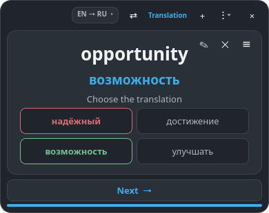
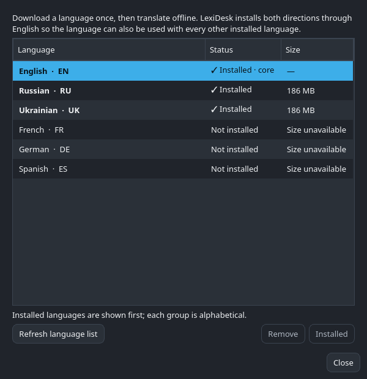

# LexiDesk

**A private, offline vocabulary widget that turns your desktop into a calm
language-learning space.**

[](https://github.com/Mozzhukhin/LexiDesk/actions/workflows/tests.yml)
[](https://github.com/Mozzhukhin/LexiDesk/actions/workflows/release.yml)
[](https://github.com/Mozzhukhin/LexiDesk/releases/latest)
[](https://www.python.org/)
[](LICENSE)

LexiDesk combines a compact Windows/Linux desktop widget, a native KDE Plasma
6 widget, offline neural translation, and FSRS 6 spaced repetition. There is no
account, cloud vocabulary, telemetry, or network dependency after the selected
languages are installed.

<table>
  <tr>
    <td width="50%"></td>
    <td width="50%"></td>
  </tr>
  <tr>
    <td align="center"><b>Passive desktop learning</b></td>
    <td align="center"><b>Adaptive practice quizzes</b></td>
  </tr>
</table>

## Why LexiDesk?

Most vocabulary tools either demand constant attention or store learning data
online. LexiDesk is designed for a different workflow:

- keep one small card on the desktop;
- see a new word automatically every 90 seconds;
- browse freely without changing learning statistics;
- occasionally answer a short adaptive quiz;
- keep vocabulary, examples, review history, and models on your own computer.

## Highlights

- **Offline multilingual translation.** Install only the languages you need,
  then translate without an internet connection.
- **Lightweight distributions.** LexiDesk Lite ships without large language
  models; packages are downloaded and removed from inside the app.
- **Real desktop-widget behavior.** Desktop mode stays behind other windows;
  Floating mode stays above them. KDE Plasma has a native QML widget.
- **FSRS 6 scheduling.** Each recall direction has independent difficulty,
  stability, due time, and accuracy.
- **Six practice modes.** Mixed, choose translation, reverse translation,
  complete the sentence, choose the context, and typed answer.
- **Meaning-aware examples.** Every card keeps one short bilingual example
  tied to the selected meaning.
- **Bidirectional decks.** One `English ⇄ Russian` card can be studied from
  either side without creating duplicate library rows.
- **Useful learning tools.** Searchable library, analytics, batch import,
  tags, JSON/CSV transfer, full backups, and diagnostics.
- **Privacy by default.** Local SQLite storage, no login, no telemetry, and no
  background network requests during study.

## Download

Use the [latest GitHub release](https://github.com/Mozzhukhin/LexiDesk/releases/latest).

| Platform | File | Notes |
| --- | --- | --- |
| Windows 10/11 x64 | `LexiDesk-Lite-Setup-Windows-x64.exe` | Installer with optional desktop and autostart shortcuts |
| Windows x64 | `LexiDesk-Lite-Windows-x64-portable.zip` | Extract the entire archive and run `LexiDesk.exe` |
| Linux x86_64 | `LexiDesk-Lite-Linux-x86_64.AppImage` | Portable build; no system Python required |
| Linux x86_64 | `LexiDesk-Lite-Linux-x86_64.tar.gz` | Standalone directory archive |
| KDE Plasma 6 | `LexiDesk-Plasma6.plasmoid` | Native QML widget; uses the installed LexiDesk core |
| Python 3.12–3.14 | `.whl` / source archive | For distributions and developers |

Windows may display a SmartScreen warning because community builds are not yet
code-signed. Verify the release checksum and download only from this repository.
The portable ZIP avoids installer-specific reputation warnings.

For AppImage:

```bash
chmod +x LexiDesk-Lite-Linux-x86_64.AppImage
./LexiDesk-Lite-Linux-x86_64.AppImage
```

## First launch and offline languages

LexiDesk Lite intentionally starts without a preselected language:

1. Select **Choose languages** on first launch, or open
   **Menu → Offline languages**.
2. Choose a language. LexiDesk installs both directions through English when
   the official catalog provides them.
3. Add a word with **+**, select source and target languages, review the local
   translation, and save the card.
4. Continue studying offline.

The language manager shows installed languages first, reports package size,
checks package compatibility, and can remove models without deleting cards or
learning progress. Downloaded models live in the user's persistent data folder,
outside the EXE/AppImage, so application upgrades keep them.



Direct translation models are preferred. If there is no direct model,
LexiDesk can use one local English pivot—for example, `UK → EN → DE`. All
translations remain editable because an isolated word can have several valid
meanings.

## Learning workflow

- **Off:** regular cards only.
- **Mixed:** four passive cards followed by one random non-typing quiz.
- **Fixed quiz:** the selected quiz type is used for every suitable card.
- **Next / timed rotation:** changes the card without recording a review.
- **Quiz answer:** records the result in FSRS and advances automatically.

Correct choices turn green. A wrong choice turns red while the correct answer
turns green. The same card cannot reappear during the next five presentations;
smaller decks adapt the cooldown to cycle through every available card first.

## Library and analytics

<table>
  <tr>
    <td width="55%"></td>
    <td width="45%"></td>
  </tr>
  <tr>
    <td align="center"><b>Deck-aware vocabulary library</b></td>
    <td align="center"><b>Local learning analytics</b></td>
  </tr>
</table>

The library separates language decks, while opposite study directions remain
two views of the same vocabulary. Analytics include daily progress, activity,
recall accuracy, difficult cards, quiz breakdown, confusions, streak, and the
seven-day review forecast.

## Architecture

```text
Native Plasma widget (QML)             Windows/Linux widget (PySide6)
             │                                      │
             └──────────── local JSON / D-Bus ──────┘
                                    │
                                    ▼
                            Application core
                    ┌───────────────┼───────────────┐
                    ▼               ▼               ▼
              FSRS scheduler   Offline CTranslate2  SQLite storage
              + quiz engine    model graph           + backups
```

Key implementation choices:

- Python 3.12–3.14 and PySide6 for the cross-platform UI;
- QML for native KDE Plasma integration;
- CTranslate2 + SentencePiece for compact CPU inference;
- SQLite for vocabulary, bidirectional FSRS state, and history;
- a bounded SQL quiz-candidate query instead of repeated full-deck scans;
- cancellable background workers for translation and batch imports;
- PyInstaller, AppImage, and Inno Setup release automation;
- native Windows and Ubuntu builds in GitHub Actions.

See [Architecture](docs/ARCHITECTURE.md) for database migrations, services,
scheduling, translation routing, and packaging details.

## Install from source

Requirements: Linux, Python 3.12–3.14, and
[`uv`](https://docs.astral.sh/uv/).

```bash
git clone https://github.com/Mozzhukhin/LexiDesk.git
cd LexiDesk
./scripts/setup.sh
./scripts/run.sh
```

On Arch Linux the setup script can reuse the distribution's PySide6 package.
It creates an isolated environment, installs the desktop integration and Plasma
widget, and leaves system Python untouched. Choose languages from the app after
the first start.

To add the Plasma widget:

`Right-click desktop → Enter Edit Mode → Add Widgets → LexiDesk`

## Development

```bash
uv sync --extra dev
uv run ruff format --check .
uv run ruff check .
uv run mypy
uv run pytest -q
uv run lexidesk
```

The project enforces formatting, linting, type checks, branch-aware test
coverage, and native packaged-runtime smoke tests. Release tags produce Windows
installer/portable packages, Linux AppImage/archive packages, a Plasma widget,
Python distributions, and SHA-256 checksums.

## Data and backups

On Linux, application data is stored under `~/.local/share/LexiDesk` and
settings under `~/.config/LexiDesk`. Windows uses the corresponding per-user
application-data folders. Daily backups retain seven days by default; a full
backup preserves cards, FSRS state, and review history.

## Support the developer

If LexiDesk is useful to you, the in-app **Support developer** page contains
the same address:

`USDT TRC20: TCJxcsKVhm2Mjs7q5XkVvLK492XLpnY8um`

## License

[MIT](LICENSE). Third-party components and language resources are documented in
[THIRD_PARTY.md](THIRD_PARTY.md).
